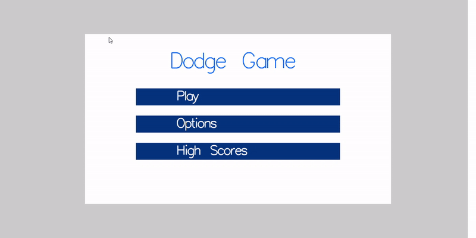

# DodgeGame - C & OpenGL

Welcome to **DodgeGame**, an interactive and fast-paced game developed in **C** using **OpenGL**! Test your reflexes and quick thinking as you dodge randomly generated objects fired at your character. Customize your gameplay, navigate through menus, and aim for the highest score in this thrilling dodging adventure!

## Features

### 🎮 Core Gameplay:
- **Random Object Firing & Animation**: Objects are fired at your character from random coordinates, requiring quick reactions to dodge.
- **Score Multiplier System**: Adjust the score multiplier based on player-defined settings (e.g., fire rate, object speed) for a balanced and customized challenge.
- **Manual UI Elements**: Custom-built user interface, including range bars, text boxes, and buttons for intuitive navigation and gameplay customization.

### ⚙️ Technical Concepts:
- **Data Structures**: Utilized multiple data structures, including point and nested structures, to handle object coordinates and game states effectively.
- **Finite State Machine (FSM)**: Employed an FSM to manage the game’s flow, allowing smooth transitions between states such as **Menu**, **Gameplay**, and **Game Over**.
- **Collision Detection**: Implemented collision detection to track when the player's character is hit by incoming objects.
- **Customizable Gameplay**: Players can adjust settings like fire rate and object speed, influencing gameplay difficulty and offering a personalized experience.

## Controls

- **Movement**: Use the mouse (right-click) to move your character and dodge incoming objects.

## Gameplay

- **Menu**: Navigate through the game’s menu to start a new game, access settings, or view the high score.
- **Settings**: Adjust gameplay parameters such as fire rate and object speed to customize the difficulty.
- **Gameplay**: Once the game starts, your goal is to avoid incoming objects, score points, and aim for a high score.

## GIF Preview

### 🎮 Gameplay:



### ⚙️ Menu & Settings:


## How to Play

1. **Start Game**: Launch the game from the main menu and begin your dodging adventure.
2. **Adjust Settings**: Modify the game parameters in the settings menu to tailor the gameplay to your preferences.
3. **Dodge Objects**: Move your character to avoid the falling objects and accumulate points.
4. **Score High**: Try to survive as long as possible while dodging and achieving the highest score!

## Installation

To run **DodgeGame** on your local machine:

1. Clone the repository:
    ```bash
    git clone https://github.com/yourusername/dodgegame.git
    cd dodgegame
    ```

2. Compile the game with:
    ```bash
    gcc -o dodgegame main.c -lGL -lGLU -lglut
    ```

3. Run the game:
    ```bash
    ./dodgegame
    ```

## Technologies Used

- **C**: The programming language used for the game’s logic.
- **OpenGL**: For rendering the graphics and animations.
- **GLUT**: For handling user input and window management.

## License

This project is licensed under the MIT License - see the [LICENSE](LICENSE) file for details.

## Acknowledgments

- Special thanks to the OpenGL community for providing essential resources and tutorials.
- Thanks to everyone who contributed to the development of this game.
